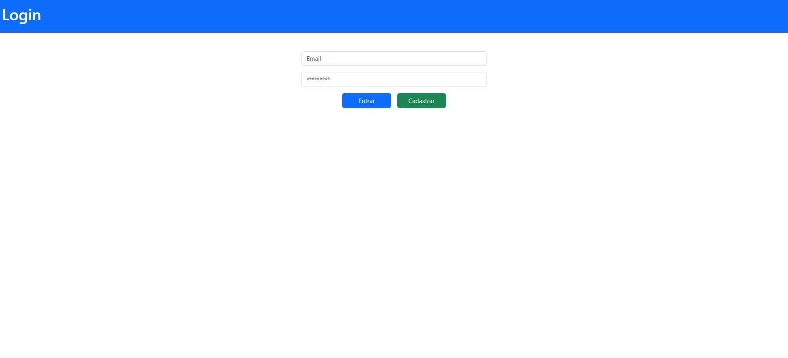

### Criando maneiras de usar um login Javascript

#### Modelos de Login.
* > HTML
* > CSS
* > Javascript
* > Bootstrap 5.3

#### Login-v1
> [ok] Login
> [ ] Cadastro
> [ ] Dashboard

  
  

#### Login-v2
> [ok] Login
> [ ] Cadastro
> [ ] Dashboard

  
  

#### Login-v3
> [ ] Login
> [ ] Cadastro
> [ ] Dashboard

